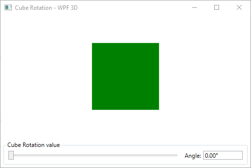
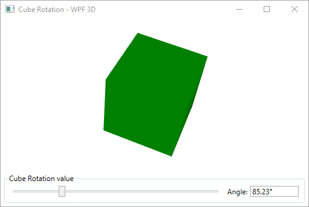

# Cube Rotation - WPF 3D
Project is a simple binding between the slider and two controls: 
- TextBox,
- Viewport3D.

It is my first test repository on GitHub.

## Screenshot

### 1. After program start

### 2 Sample cube rotation

